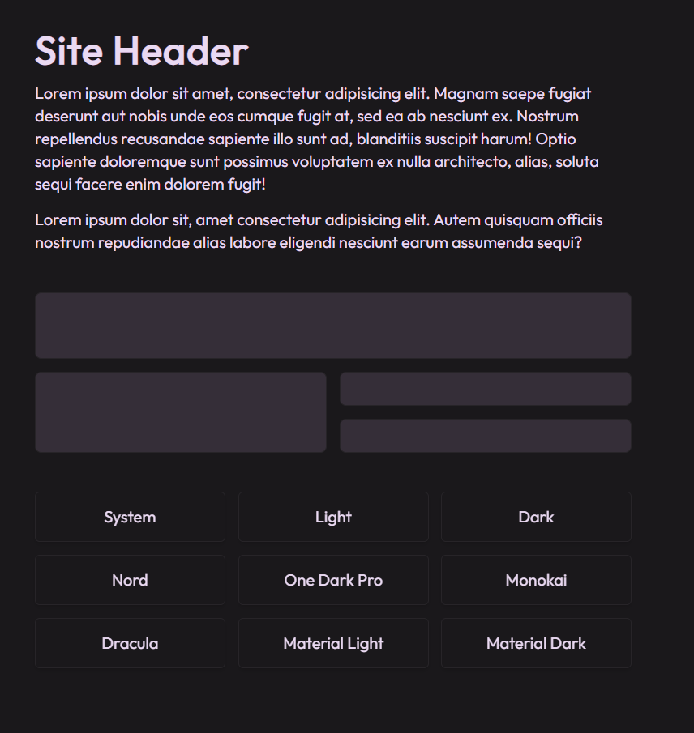
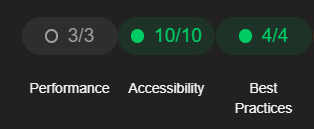

<!-- Docker -->
<div align="center">
    <!-- Vue -->
    
    <!-- JavaScript -->
    
    <!-- Typescript -->
    
    <!-- Tailwindcss -->
    
    <!-- Docker -->
    
</div>

<br />

<h1 align="center">
vue-web-themes
</h1>

I wanted to learn vue as an opportunity to deepen my understanding of frontend web development, this repository serves as an excuse for me to do just that!
<br/>

<div align="center">
    
</div>

<div align="center">
    
</div>

> In order to see the outcome of this project, you must set up your own development enviroment, then build the webpage(s).

## **Clone the repository:**

```shell
git clone https://github.com/jakemackie/vue-web-themes vue-web-themes
```

> change the "vue-web-themes" parameter to a folder name you'd like to save this project to.

## **Install various dependencies:**

NodeJS

```shell
npm i
```

> Please ensure you have [NodeJS](https://nodejs.org/en) installed.

## **Run the localhost**

```shell
npm run dev
```

## **Want to Dockerise the app?**

`1.`

```shell
docker build -t vue-web-themes:latest .
```

`2.`

```shell
docker run -p 8000:8000 vue-web-themes:latest
```

`3.`

Visit http://localhost:8000

> Please ensure you have [Docker](https://www.docker.com/) installed.
